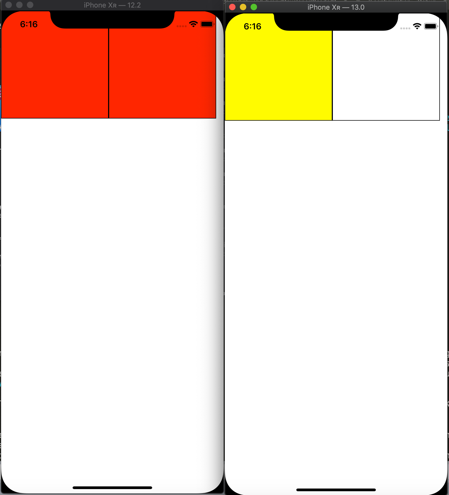

### What's for

This is a demo project about UIKit's issue on iOS 13 Beta. The issue related to the animated UIImage and UIImageView on UIKit.

### Environment for issue

+ iOS version: iOS 13 beta4 (17A5534d)
+ Xcode version: 11.0 beta 4 (11M374r)

### Step to reproduce

1. Prepare an animated `UIImage` using the API [animatedImageWithImages:duration:](https://developer.apple.com/documentation/uikit/uiimage/1624149-animatedimagewithimages?language=objc) or [animatedImageNamed:duration:](https://developer.apple.com/documentation/uikit/uiimage/1624094-animatedimagenamed?language=objc)
2. Create a `UIImageView` with zero frame. You can use `[[UIImageView alloc] init]` or zero frame
3. Attach the imageView to view hierarchy
4. Set the animated image to imageView
5. Change imageView's frame into a larger one like `(0, 0, 200, 200)`
6. See the animation result, the imageView does not play animation at all

### Excepted behavior

On iOS 12 and all previous iOS versions, the imageView still play animation even we change the frame.
On iOS 13, it seems the animation was not played at all. It may because of UIKit's team optimization of animation.

See screenshot compare between these versions:



### Workaround currently

The one workaround I found, it's to reset the `UIImageView.image` property after we change frame, using the tricky code like this:

```objective-c
UIImageView *imageView;
UIImage *tempImage = imageView.image;
imageView.image = nil; // This is magic to reset status
imageView.image = tempImage;
```

This looks strange and increase your codebase's complexity. But until Apple fix this issue, I have no any idea to solve the problem.

### My Idea

I think this behavior changes is not a designed behavior. Because for many cases, like using network images, the imageView's frame can not be determined until the image instance is available (download from network), many users prefer to use image's size to adjust their imageView after image available. This break current third party framework's logic, including [SDWebImage](https://github.com/SDWebImage/SDWebImage) and [Kingfisher](https://github.com/onevcat/Kingfisher).

I think a better solution to handle both the performance and behavior, can use the following logic (just my idea, UIKit team can have a better solution).

1. When user set an animated image on imageView which is not showing at all (frame == zero, or hidden == YES, or alpha == 0.0, all the cases), do not play animation
2. Once the user make this imageView appear (frame != zero, hidden == NO, alpha > 0.0), we should immediately play animation
3. This internal animation status should not be visible to user, which means even (frame == zero), the `isAnimating` or any public API's property should still report the correct value as previous iOS verion's behavior.

